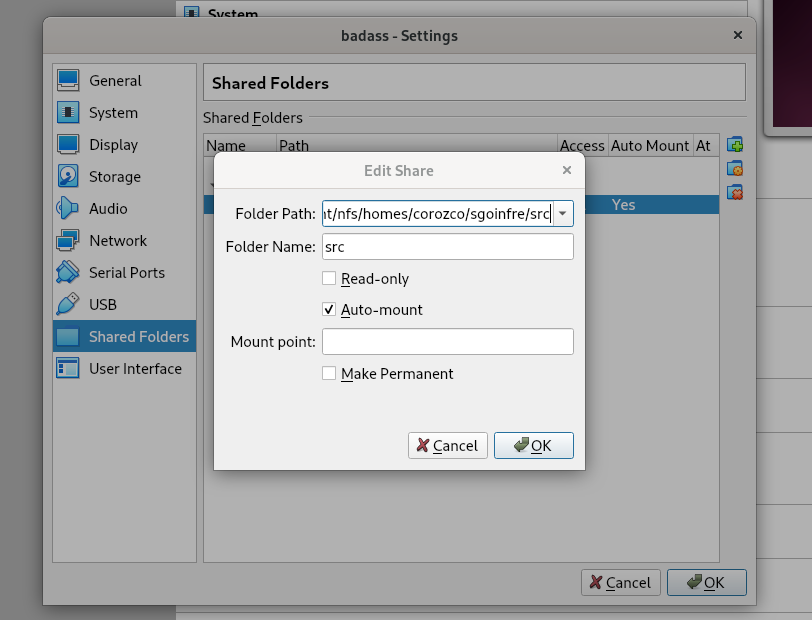
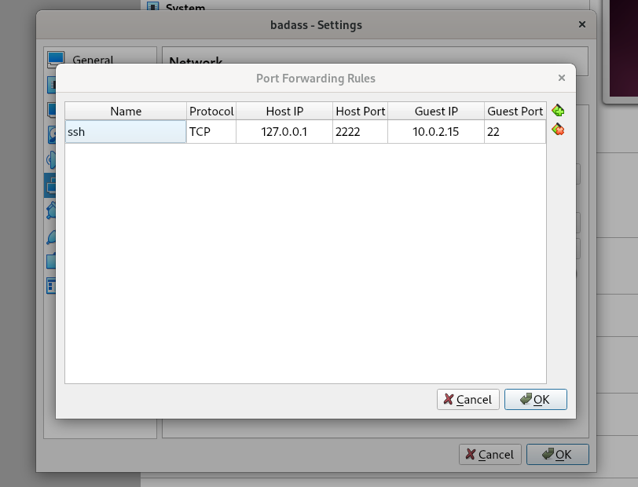

# Patager un dossier host et SSH


## 1) Vm settings -> Shared Folders


## 2) VM settings -> Netword -> Avanced -> Port Forwarding


## Pour partager le dossier
```
	mkdir -pv $HOME/shared
```
le nom, celui que tu as mis dans la image 1
```
	sudo mount -t vboxsf [nom dossier host] $HOME/shared
```

## installer [ifconfig, opeenshh-server, git]
```
	cd $HOME/shared
	sh setup.sh
```
### dehors la vm
ssh -p [port] [utilisateur]@localhost
```
	ssh -p 2222 badass@localhost
```