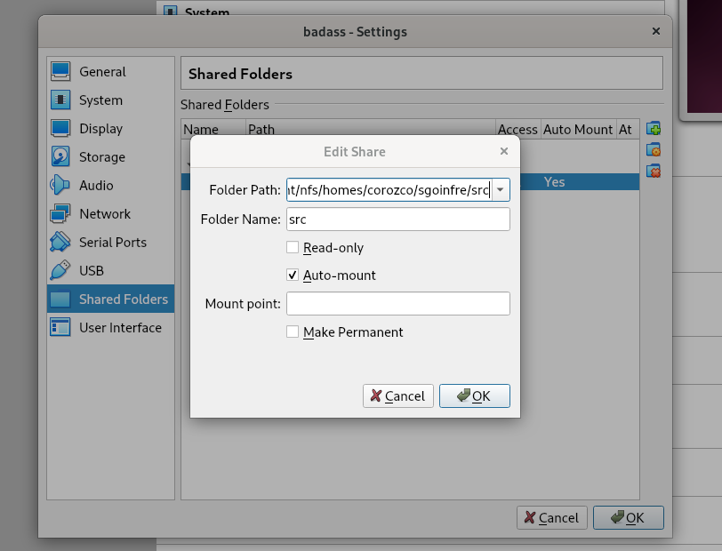
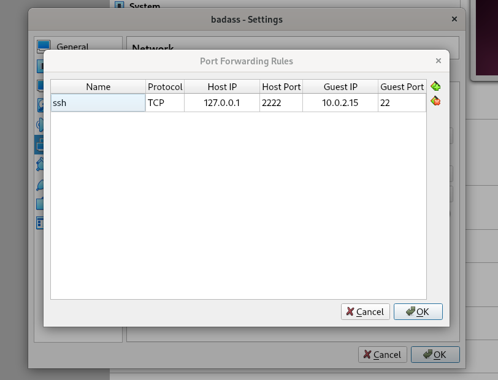

# Patager un dossier host et SSH


## 1) Vm settings -> Shared Folders


## Pour partager le dossier (env: vm)
##
```
	mkdir -pv $HOME/shared
```
##
le nom de celui que tu as mis dans la image 1
```
	sudo mount -t vboxsf [nom dossier host] $HOME/shared
```

## 2) pour te connecter en ssh a la vm

### installer [ifconfig, opeenshh-server, git] (env: vm)
```
	cd $HOME/shared/doc/
	sh setup.sh
```

### VM settings -> Netword -> Avanced -> Port Forwarding


### (env: local)
ssh -p [port] [utilisateur]@localhost
```
	ssh -p 2222 badass@localhost
```
